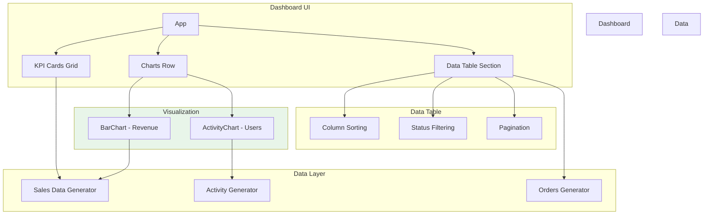
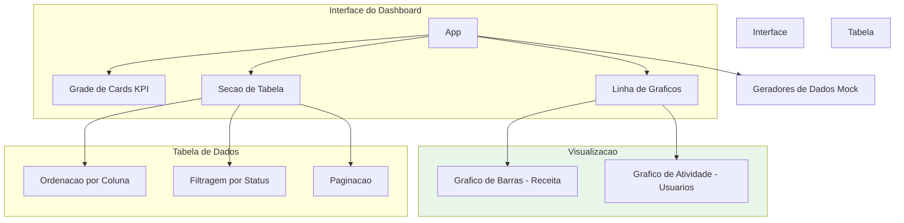

# React Admin Dashboard

<div align="center">


</div>


Administrative dashboard built with React featuring KPI cards, interactive bar charts, sortable data tables with pagination, status filtering, and user activity visualization.

[English](#english) | [Portugues](#portugues)

---

## English

### Overview

A comprehensive admin dashboard that displays business metrics through KPI cards, revenue charts, user activity graphs, and a sortable orders table with status filtering and pagination. Built with React hooks and inline styles without external charting libraries.

### Architecture



### Features

- KPI cards with revenue, orders, customers, and growth metrics
- Bar chart for monthly revenue visualization
- Stacked activity chart showing active and new users
- Sortable data table with column-based ordering
- Status badge filtering (All, Completed, Processing, Shipped, Cancelled)
- Client-side pagination
- Responsive grid layout
- Mock data generation for demonstration

### Quick Start

```bash
git clone https://github.com/galafis/React-Admin-Dashboard.git
cd React-Admin-Dashboard
npm install
npm start
```

### License

MIT License - see [LICENSE](LICENSE) for details.

### Author

**Gabriel Demetrios Lafis**
- GitHub: [@galafis](https://github.com/galafis)
- LinkedIn: [Gabriel Demetrios Lafis](https://linkedin.com/in/gabriel-demetrios-lafis)

---

## Portugues

### Visao Geral

Dashboard administrativo abrangente que exibe metricas de negocios atraves de cards KPI, graficos de receita, graficos de atividade de usuarios e tabela de pedidos com ordenacao, filtragem por status e paginacao. Construido com React hooks e estilos inline.

### Arquitetura



### Funcionalidades

- Cards KPI com receita, pedidos, clientes e metricas de crescimento
- Grafico de barras para visualizacao de receita mensal
- Grafico de atividade mostrando usuarios ativos e novos
- Tabela de dados ordenavel por coluna
- Filtragem por badges de status
- Paginacao no lado do cliente
- Layout de grade responsivo

### Inicio Rapido

```bash
git clone https://github.com/galafis/React-Admin-Dashboard.git
cd React-Admin-Dashboard
npm install
npm start
```

### Licenca

Licenca MIT - veja [LICENSE](LICENSE) para detalhes.

### Autor

**Gabriel Demetrios Lafis**
- GitHub: [@galafis](https://github.com/galafis)
- LinkedIn: [Gabriel Demetrios Lafis](https://linkedin.com/in/gabriel-demetrios-lafis)
